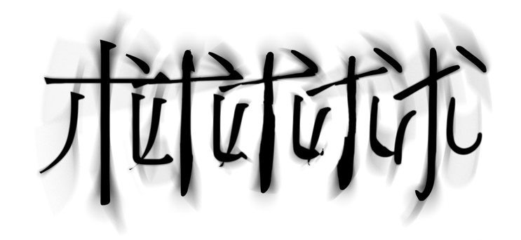
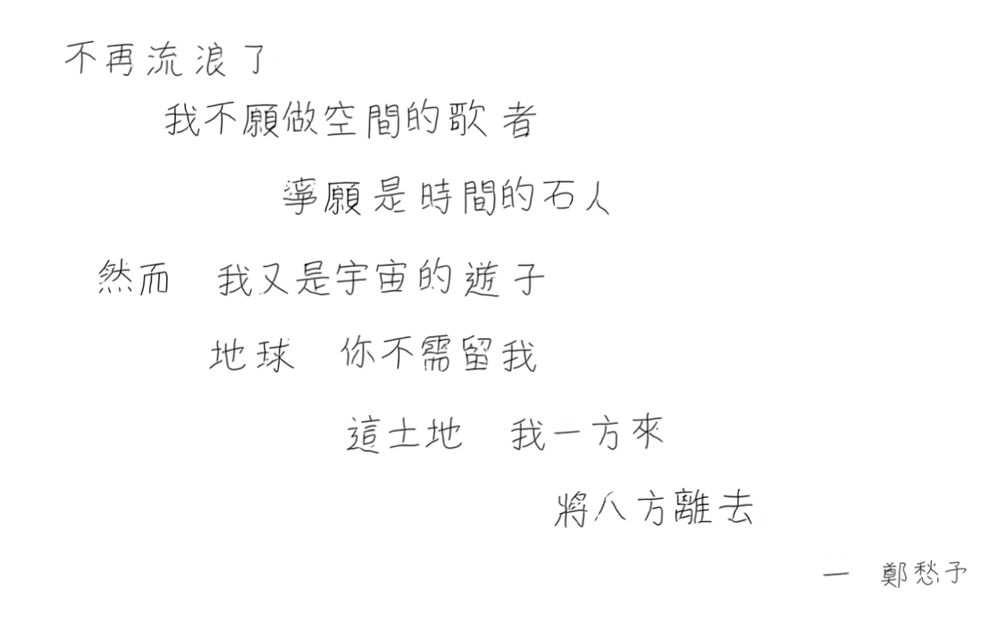
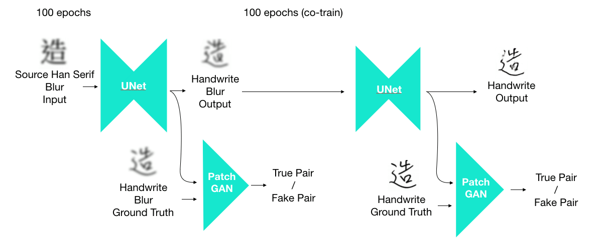
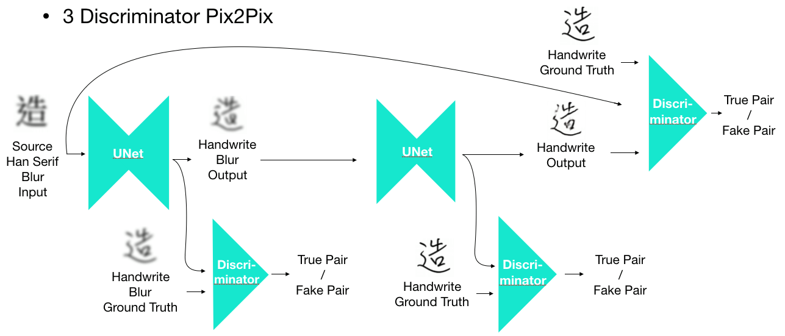

# Cascaded-GAN : Chinese Handwriting Generator
 
 The major contributors of this repository are <a href="https://github.com/YiChuanChang">YCChang</a> and <a href="https://github.com/refu0523">Refu</a>
## Introduction
 We proposed a Chinese handwriting generator via cascaded-pix2pix to generate the handwriting with specific style. Our model takes the font charectar image as input and generate the handwriting iamge as output. In our experiment, we use 1000 differnet charectars in train_list.txt with source Han Serif(思源宋體) and handwriting to train our model. With the trained model, we can generate the unseen charactars very well.  

 The generated handwritting poem.



 In the origin pix2pix, it foucs on the image-to-image translation which the image pair are usually in the same position and structure. However, for handwriting generation, the font charectars and handwriting may vary a lot. Therefore, the result was not very good.

 We proposed the innovative cascaded pix2pix try to imporve the performance of generation. We use the blurred images as input ato make the position and structure be easiler to learn in the first pix2pix. After training for 100 epochs, we add another pix2pix to make blur handwriting to clear handwriting, and train the cascded pix2pix together to make sure the training procedure stable. Besides, we use the spectral normalization to constraint the Lipschitz constant to make it more stable.
 
##Installation
###Clone Cascaded-GAN
Clone this repository to your own machine
```
git clone https://github.com/refu0523/cascaded-pix2pix---Chinese-handwriting-generator-.git
cd cascaded-pix2pix---Chinese-handwriting-generator-
```

###Prepare data
__Step1__: Create a folder named 'img' and use text2img.py and font file to generate character images. Followings are parameters you can adjust in text.py

| parameters    | Dafault Value | description|
| :------------ |:------------- | :-----|
| --font_style  | msjhbd.ttc    | Font file you want to convert. You should use ttf or otf files, using ttc file may cause error. You just need to put the font file in the same folder with text2img.py  |
| --font_size   | 100           | The font size you want to generate. Please use integer. |
| --img_size    | 128           | The image size you want to generate. Default this program will generate image with resolution 128*128|


Usage example

```
python text2img.py --font_style LingWaiTC-Medium.otf
```

__Step2__: Convert images into the format fitting the input of training program. Here we will generate traning data and testing data. However, common used Chinese character is not continueous in utf-8 encoding. We list out 3000 common used Chinese charactor in train.txt and test.txt. Based on these two list, we cangerate training and testing data with concat_photo.py

| parameters    | Dafault Value          | description|
| :------------ |:-------------          | :-----|
| --path_a      | 'mingliu'              | This is the path of the folder containing source font images |
| --path_b      | 'LingWaiTC-Medium_128' | This is the path of the folder containing target font images |
| --path_output | 'concat'               | This is the name of output folder|
| --blur_size   | 4                      | This is the kernel size of Gaussian Blur |
| --crop_size   | 8                      | Crop out the image generated from text2img.py. |

Usage example

```
python concat_photo.py --path_output enlarge --crop_size 15
```
__Step3__: Put the folder generated by concat_photo.py into dataset

###Training
Use pix2pix_2D_s.py or pix2pix_3D_s.py to train your model. THe difference of these two file is number of discriminators. 

| parameters        | Dafault Value          | description|
| :------------     |:-------------          | :-----|
| --height          | 128    | Image height |
| --width           | 128    | Image width |
| --epoch.          | 200    | The total number of training epoch|
| --in_depth        | 3      | Input image depth. Default is 3(RGB). |
| --out_depth       | 3      | Output Image depth. Default is 3(RGB). |
| --lambda_A        | 100    | L1 weight of loss function |
| --lr              | 0.0002 | Learning rate |
| --ndf             | 64     | The number of discriminator filter |
| --ngf             | 64     | THe number of generator filter |
| --experiment_name | _      | The name of current experiment. This would be used to generate corresponding folder containing training process, training log and training result|

### Output Folders
Training program would generate 3 folders. Followings are folder names and their description. ExperimentName is what you assign for --experiment_name in the training programming

| Folder      | description |
| :---------- | :---------- |
| checkpoint_ExperimentName | We will save the result to every epoch and the checkpoints in this folder |
| log_ExperimentName        | We save the tensorboard infomation here |
| result_ExperimentName     | We save the result of testing data here |

###Check training status
```
tensorboard --logdir logs_ExperimentName --port 6007
```
The defaulf port is 6006. But you can change it into any vacant port. 


 * pix2pix_2d: cascaded pix2pix  
 


 * pix2pix_3d: cascaded pix2pix  
 

